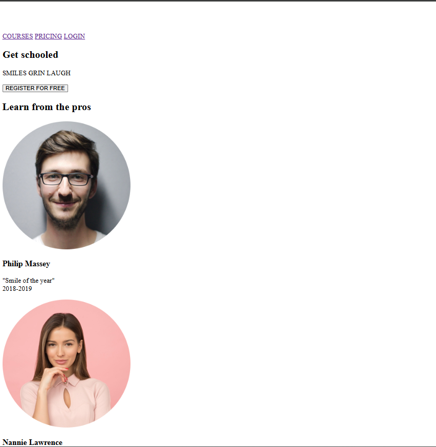

## Resources

**Read or watch**:

- [Learn to Code HTML & CSS](/rltoken/D6o845Dj6bWanYggYGQK4A "Learn to Code HTML & CSS") (_until “Creating Lists” included_)
- [Introduction to HTML](/rltoken/pi2d_GWRubaTHQfAmKb8FQ "Introduction to HTML")
- [MDN](/rltoken/STnL1M-mwzCvnzHtG21XGQ "MDN")

## Learning Objectives

At the end of this project, you are expected to be able to [explain to anyone](/rltoken/tk1bYe9n6YmcEsF-gwOgMA "explain to anyone"), **without the help of Google**:

### General

- What is HTML
- How to create an HTML page from a wireframe
- What is a markup language
- What is the DOM
- What is an element / tag
- What is an attribute
- What the purpose of each HTML tag

## Requirements

### General

- All your files should end with a new line
- A `README.md` file, at the root of the folder of the project is mandatory
- You are **not allowed** to install, import or use external libraries. This website must be build with only HTML/CSS/JavaScript. No NodeJS, React, VueJS, Bootstrap, etc.
- Your code should be W3C compliant and validate with [W3C-Validator](/rltoken/czWaAX6ZYwSLoR3bh2Qiqg "W3C-Validator")

## Tasks

### 1.

In this and coming projects, you will implement from scratch a webpage from a designer file.

For this first project, you will focus on the HTML structure only - **no CSS, no style - just pure HTML semantic.**

This designer file will be available on [Figma](/rltoken/ChJbK90Un6oS2A6ozdyTQA "Figma") - feel free to create an account to access the final result here:

- [Page in Figma](/rltoken/lhaBvvfXnyGKs9bRxokWtQ "Page in Figma")
- [fig file](/rltoken/BOC4LSHhGgn-RudlXjuUKg "fig file")

And “Duplicate to your Drafts” to have access to all design details.

Important notes with Figma:

- if your computer doesn’t have missing fonts, you can find them here: [source-sans-pro](/rltoken/76O2REi_XN8esxhm9fZg9w "source-sans-pro") and [Spin-Cycle-OT](/rltoken/tIZuYvssJ291nB0BWUl-Tw "Spin-Cycle-OT")
- some values are in float - feel free to round them

For this task, please write an amazing `README.md`

### 2.

Let’s start at the top: **the header**

Here is the wireframe of it:

- Create the HTML skeleton (`html`, `head`, `body`, etc.)
- In the body, add a `header` tag
- Inside this `header`:
  - Add a link element with an image inside
  - Add a block of 3 link elements

### 3.

Now, the banner inside the `main`:

Add a `main` tag that has a `section` element inside.

In this `section` element, add:

- A block containing:
  - A heading tag (level 1, don’t forget to use the correct heading value)
  - A text element
  - A button tag
- Another block containing:
  - Another heading tag (level 2, be careful about which one you are using)
  - A block containing 4 blocks - each block containing:
    - An image
    - A heading tag (level 3)
    - A text

### 4.

Under the banner, we will add the quote block:

The quote section is inside the `main`:

- Create a new `section` for the quote
- Inside, add a block containing:
  - An image
  - Another block with inside:
    - A blockquote tag
    - A text tag for the quote author
    - Another text

### 5.

Let’s now add the videos list:

New `section` containing:

- A heading tag (level 1)
- A block containing the 4 video blocks - each of them are composed with:
  - An image
  - A heading (level 2)
  - A text
  - Add a block for the author information:
    - An image
    - A heading (level 3)
  - A block for the rating:
    - A block of images (one star = one image)
    - A text

### 6.

The Membership section is similar to the videos list:

After the videos list section, add a new `section` containing:

- A heading (level 1)
- A block containing 4 block items - each block containing:
  - An image
  - A heading (level 2)
  - A text
- A button

### 7.

The FAQ section is ending the page before the footer:

Add a `section` for the FAQ containing:

- A heading (level 1)
- A block that contains 2 “row blocks”
- Each “row block” contains 2 “item blocks”
- Each “item block” is composed of:
  - A heading (level 2)
  - A text

Hint: There is no “row block” tag, “row” is referring to the styling that will be applied in a future project. It just means two “rows” containing two “items” each, also containing their own elements.

### 8.

And… the footer!

After the last `section`, outside of the `main`, add a `footer`:

- A block (used later for centering the footer content), inside this block:
  - Another block with:
    - An image
    - Another block containing:
      - 3 Images with link
  - A text

And… that’s it for the moment - the result should not be shiny, don’t worry, CSS is coming…

### image of a part of the result :

